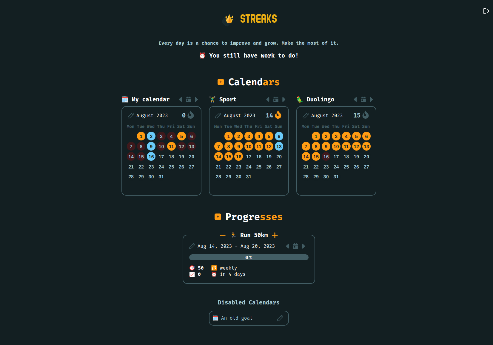

Streaks
=======

Streaks is a habit-tracking app that relies on streaks (like Duolingo or Snapchat), to help you build habits.

The principle is simple, when you accomplish your goal of the day you accumulate streaks, and the more streaks you have, the less you want to lose them (by not accomplishing your goal).



There is also [Streaks Runner](https://git.chevro.fr/streaks/runner), to automate your tasks.

Installation
============

With Docker (recommended)
-------------------------
Download the `docker-compose.yml`
```bash
mkdir streaks && cd "$_"
wget https://git.chevro.fr/streaks/runner/-/raw/main/docker-compose.yml
```

Edit the `docker-compose.yml` to suit your needs.

**Go to the [Configuration](#configuration) section to edit your `.env` file, then come back here.**

Start your container with:
```bash
docker-compose up -d
```

You can check that everything went well by looking at the container logs:
```bash
docker-compose logs
```

Manual install
--------------
Officially supported on Linux, may work on another platform.

Install the following dependencies on your server:
- NodeJS (with npm)

Clone the repository:
```bash
git clone https://git.chevro.fr/streaks/streaks.git streaks && cd streaks
```

You can now install the runner dependencies:
```bash
npm i
```

**Go to the [Configuration](#configuration) section to edit your `.env` file, then come back here.**

Build and start the server with:
```bash
npm run build
npm run start
```

Configuration
=============

Use the creation script to create your `.env` file.

If you use docker, run:
```bash
docker-compose exec streaks node user_scripts/set_env.js
```
Otherwise, run:
```bash
node user_scripts/set_env.js
```

This script should create an `.env` file that looks like this:
```env
PORT=80
TZ=Europe/Paris
JWT_KEY=random
MONGO_URI=mongodb+srv://your-mongodb-connection-string
```
Edit-it to suit your needs.

**If the MongoDB database is the one deployed by the `docker-compose.yml`, leave `MONGO_URI` empty.**
